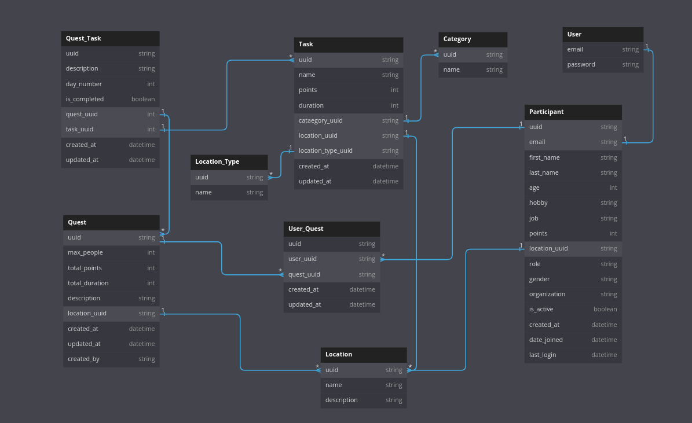

# Revitalizing Rural Japan: Bridging Communities for Sustainable Growth

## Table of Contents
* [Background](#background)
* [Issues and Solution](#issues-and-solution)
* [Hackathon Goals](#hackathon-goals)
* [Installation](#installation)
* [Usage](#usage)
* [Features](#features)
* [Schema](#schema)
* [Technologies Used](#technologies-used)
* [Team Members](#team-members)

## Background

Japan's aging population, declining birthrate, and shrinking rural workforce threaten the preservation of local economies, culture, and heritage. This project addresses these challenges.  

## Issues and Solution

* **Local Issues:** Labor shortages impact farms, forests, and cultural preservation. Communities seek individuals who resonate with their values.
* **User Issues:** People want to support rural areas but need trial experiences before relocating. 
* **Solution:** A platform matching short-term, meaningful work with immersive rural experiences, connecting users to communities with shared values.

## Hackathon Goals

Develop core platform functions to foster revitalization and user engagement through a "quest" system combining work, culture, and leisure.

* **Specific Functionality:**
    * Secure login (user and community manager)
    * Intuitive location-based quest registration
    * User-friendly quest scheduling tools
    * LLM-powered search for optimized results
    * Streamlined quest request process

## Installation

**Frontend** 
* `npm install`
* `npm start`

**Backend**
* `pip install -r requirements.txt`
* `python manage.py runserver`

## Usage

* **Log in/Sign up:** Use credentials, with separate access for users and community managers.
* **Quest Registration:** Community managers register quests based on location. 
* **Scheduling:** Users view quests in their location using scheduling tools.
* **Search:** Find quests aligned with preferences using the LLM-powered search.
* **Request:** Users submit quest requests.

## Features

* Distinct user/community manager login
* Location-centric quest registration 
* User-friendly quest scheduling 
* LLM-enhanced quest search
* Streamlined quest request system

## Schema

## Technologies Used

* **Design:** Figma
* **Front-end:** React
* **Back-end:** Django
* **Database:** PostgreSQL

## Team Members

* Mohammad Shehar Yaar Tausif
* Rohan Raju Meshram
* Ritik Raj

